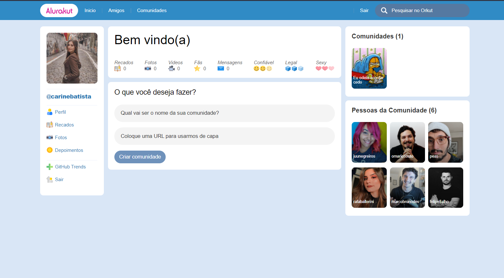

<h1 align="center">
  
</h1>

  
  

  
You can see this project running in Production here: [Alurakut](https://alurakut-blond-phi.vercel.app/)

## ✨ Technologies

This Project was built using the following Technologies:

- [React](https://reactjs.org)
- [DatoCMS](https://www.datocms.com/)

## 💻 Project

Alurakut is a Orkut's clone, let's dive into the past! 

## 🚀 How it Runs?

- Clone this Repo
- Install the dependencies with `npm install`
- Run the server with `npm start`

You can open [`localhost:3000`](http://localhost:3000) to view it in the browser.

## 📄 License

This project is under the MIT license. See [LICENSE](LICENSE.md) for more details

